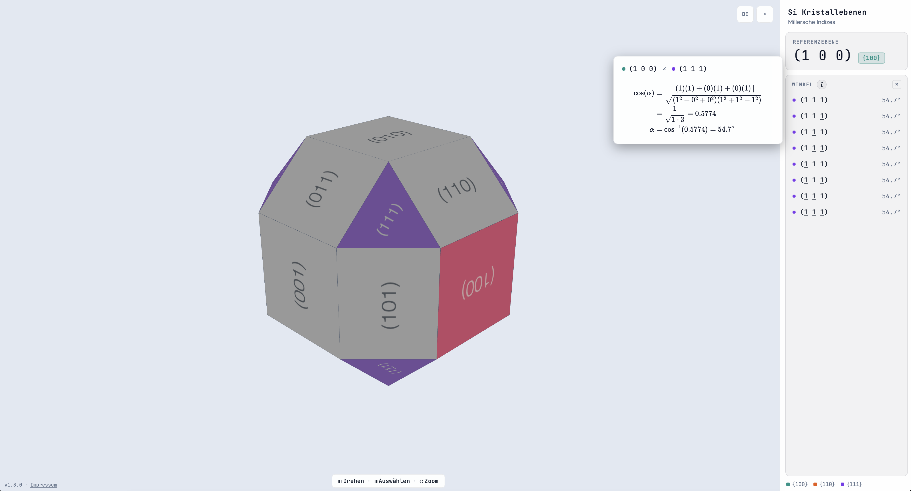
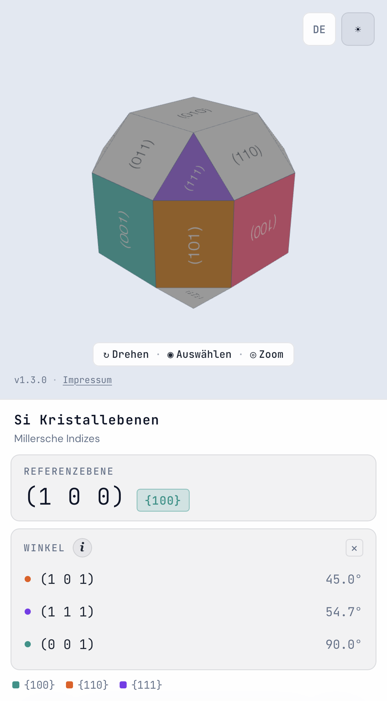

# Silicon Cube (TUM MW0080) 

Compact web app to accompany the TUM lecture MW0080 Microsensor & Actuators (Mikrotechnische Sensoren und Aktoren). 
Intended to make the lectures Silicon cube more accessible and help with visualization and calculation of Miller indices and crystal plane angles.

  <picture>
    <source media="(prefers-color-scheme: dark)" srcset="./docs/screenshots/desktop-dark.png">
    
  </picture>
  <picture>
    <source media="(prefers-color-scheme: dark)" srcset="./docs/screenshots/mobile-dark.png">
    
  </picture>

## Usage

_The **?** button in the toolbar runs a short interactive tour that demonstrates everything below on
the cube itself. It opens by itself on a first visit and can be replayed at any time._

The app is adapted for both desktop use and touchscreens.

|                                | Mouse                            | Touch           |
|--------------------------------| -------------------------------- | --------------- |
| Rotate                         | Drag                             | Drag            |
| Zoom                           | Scroll wheel                     | Pinch           |
| Select a plane                 | Right-click                      | Tap             |
| Select equivalent {•••} planes | Shift + right-click           | Long-press      |
| Clear the selection            | `Esc`, or right-click empty space | Tap empty space |

The **first** plane you pick becomes the reference plane. Every plane you select
after that is listed with its angle to that reference.
Angles are always reported as the acute angle between the two planes, so they never
exceed 90°. **Click any angle in the list to see how it was calculated.** 

## Development

Feel free to contribute code, make change requests or reach out to me. The app is supposed to help students taking the course and any help in improving it is greatly appreciated :)

**Email:** victor.hucklenbroich@tum.de

> [!NOTE]
> This is an independent, non-commercial, open-source student project, which is not officially affiliated with, endorsed by, or operated by the Technical University of Munich (TUM).
